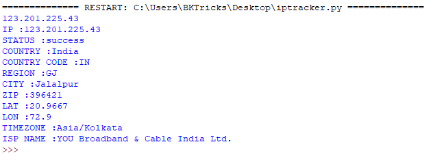

# IP-Logger [Grabbing Banners, Hostname and IP Lookup]

Ip logger Location tracker is Python tool designed to help you to find out the estimated location of your friends (their permission required) To find the exact location of Your Friend you need to copy and paste latitude and longitude on the map, for example, the location where you want to meet your friends. After generating latitude and longitude you can find accurate GPS location, you will see Your Friend Location on Google Map.

Usage: python iplogger.py www.cybernaut.cf OR
       python iplogger.py 123.201.29.29

